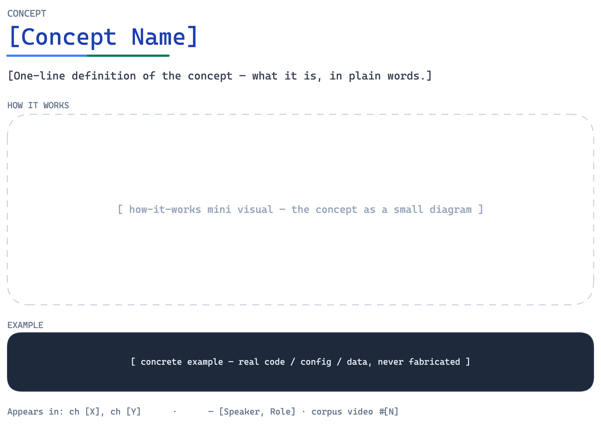
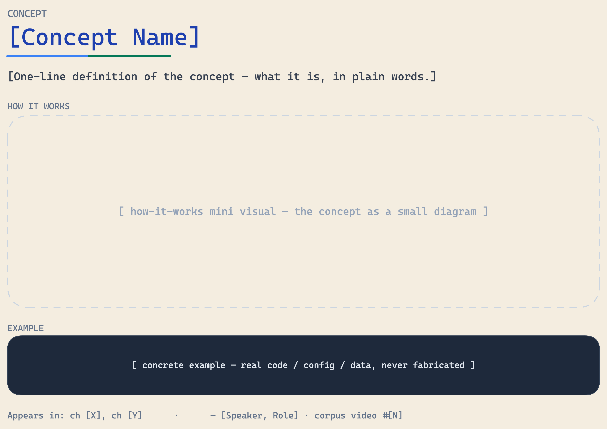
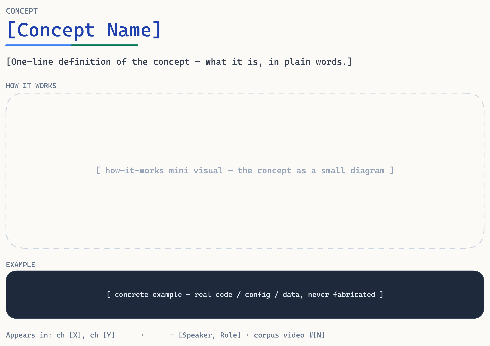
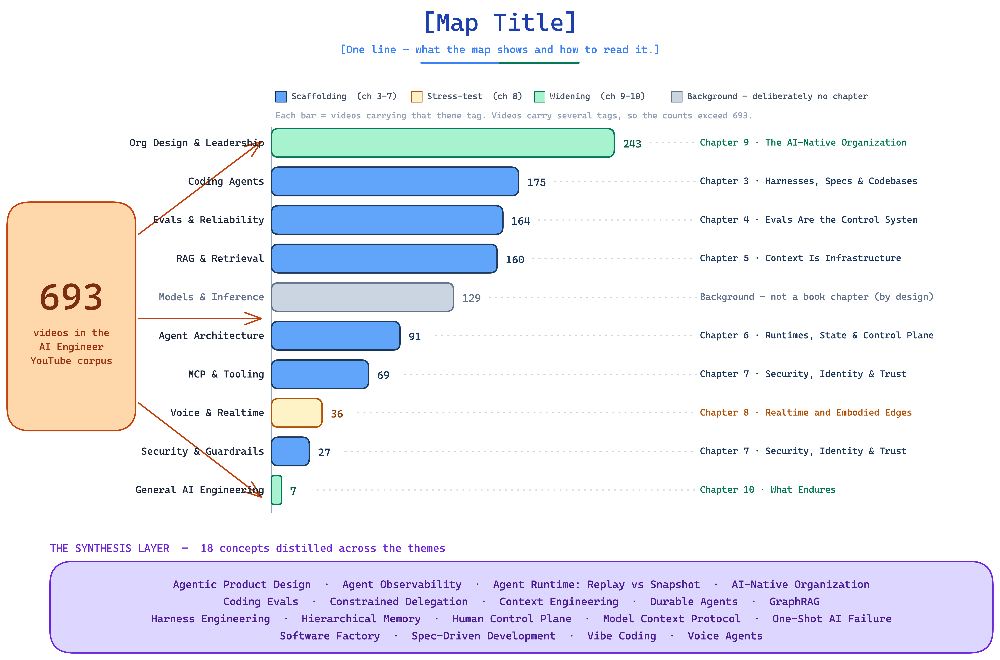
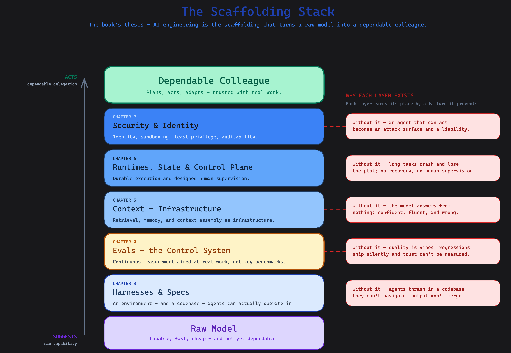

<p align="center">
  
</p>

<h1 align="center">excalidraw-skill-pack</h1>

<p align="center">
  Make your AI agent argue visually.<br/>
  Universal skill pack for Excalidraw diagrams across Claude Code, Cursor, Codex, Gemini CLI, and any MCP-compatible agent.
</p>

<p align="center">
  <a href="https://excalidraw-skill-pack.dev"></a>
  <a href="https://www.npmjs.com/package/excalidraw-render"></a>
  <a href="https://pypi.org/project/excalidraw-render/"></a>
  <a href="LICENSE"></a>
</p>

## Install

| For | Command |
|---|---|
| Claude Code | `npx @excalidraw-skill-pack/install claude-code` |
| Cursor | `npx @excalidraw-skill-pack/install cursor` |
| Codex | `npx @excalidraw-skill-pack/install codex` |
| Gemini CLI | `npx @excalidraw-skill-pack/install gemini-cli` |
| Any MCP agent | `npx @excalidraw-skill-pack/mcp-server` |
| Renderer only (Node) | `npx excalidraw-render diagram.excalidraw --theme stripe-press` |
| Renderer only (Python) | `pipx install excalidraw-render && excalidraw-render diagram.excalidraw --theme stripe-press` |

## Themes

<p align="center">
  
  
  
  
  
</p>

Five themes ship in v0.1. Authoring a new theme is 20 lines of JSON + `npm publish`:

```bash
npx create-excalidraw-theme my-brand
cd theme-my-brand && npm publish --access public
```

[Browse the theme registry →](https://excalidraw-skill-pack.dev/themes)

## Proof

64 diagrams in [*From Copilot to Colleague*](https://fromcopilottocolleague.com) were generated with this methodology. [See the gallery →](https://excalidraw-skill-pack.dev/examples)

## Methodology

Diagrams are arguments. The shape should BE the meaning.

- **Isomorphism Test:** would the structure alone communicate the concept?
- **Evidence artifacts:** real code snippets, actual API names, concrete formats — not placeholder text.
- **One accent per diagram.** Two means a competing argument; split it.

Read the [full methodology](https://excalidraw-skill-pack.dev/spec/theme-manifest) (it's also what the AI agent reads).

## License

MIT. Contributions welcome — see [CONTRIBUTING.md](CONTRIBUTING.md).
