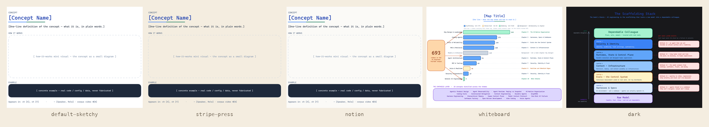

<p align="center">
  
</p>

<h1 align="center">excalidraw-skill-pack</h1>

<p align="center">
  <strong>Diagrams that argue — not boxes that label.</strong><br/>
  The diagram-<em>quality</em> layer for AI agents: an opinionated Excalidraw methodology + themes that turns "draw me a diagram" into figures that actually teach.<br/>
  Works in Claude Code, Cursor, GitHub Copilot, Codex, Gemini CLI, and any MCP-compatible agent.
</p>

<p align="center">
  <a href="https://excalidraw-skill-pack.vercel.app"></a>
  <a href="https://www.npmjs.com/package/@excalidraw-skill-pack/render"></a>
  <a href="https://pypi.org/project/excalidraw-skill-pack-render/"></a>
  <a href="LICENSE"></a>
</p>

## Install

| For | Command |
|---|---|
| Claude Code (plugin) | `/plugin marketplace add isatimur/excalidraw-skill-pack` then `/plugin install excalidraw-skill-pack` |
| Claude Code (script) | `npx @excalidraw-skill-pack/install claude-code` |
| Cursor | `npx @excalidraw-skill-pack/install cursor` |
| GitHub Copilot | `npx @excalidraw-skill-pack/install copilot` |
| Codex | `npx @excalidraw-skill-pack/install codex` |
| Gemini CLI | `npx @excalidraw-skill-pack/install gemini-cli` |
| Any MCP agent | `npx @excalidraw-skill-pack/mcp-server` |
| Renderer only (Node) | `npx @excalidraw-skill-pack/render diagram.excalidraw --theme stripe-press` |
| Renderer only (Python) | `pipx install excalidraw-skill-pack-render && excalidraw-render diagram.excalidraw --theme stripe-press` |

## Why this, not just another Excalidraw MCP?

Excalidraw's [official MCP](https://github.com/excalidraw/excalidraw-mcp) and most community servers solve **plumbing**: get an agent to emit valid JSON and render it. They produce correct boxes-and-arrows.

This pack solves **taste**: an opinionated methodology — the isomorphism test, evidence artifacts, multi-zoom architecture, container discipline, one-accent-per-diagram — that decides *what* to draw and *why*, so the output is a visual argument that teaches instead of a labeled grid. That's the part a weekend of MCP code can't copy, and it's why the [book gallery](#proof) looks the way it does.

Plumbing is a commodity now. Quality isn't.

## Themes

<p align="center">
  
  
  
  
  
</p>

Five themes ship in v0.1. Authoring a new theme is 20 lines of JSON + `npm publish`:

```bash
npx @excalidraw-skill-pack/create-theme my-brand
cd theme-my-brand && npm publish --access public
```

[Browse the theme registry →](https://excalidraw-skill-pack.vercel.app/themes)

## Published packages (v0.1)

| Channel | Package | Purpose |
|---|---|---|
| npm | [`@excalidraw-skill-pack/core`](https://www.npmjs.com/package/@excalidraw-skill-pack/core) | Methodology + bundled `default-sketchy` theme + schemas |
| npm | [`@excalidraw-skill-pack/render`](https://www.npmjs.com/package/@excalidraw-skill-pack/render) | Node renderer (`excalidraw-render` CLI) |
| npm | [`@excalidraw-skill-pack/mcp-server`](https://www.npmjs.com/package/@excalidraw-skill-pack/mcp-server) | stdio MCP server with 5 tools |
| npm | [`@excalidraw-skill-pack/install`](https://www.npmjs.com/package/@excalidraw-skill-pack/install) | One-command adapter installer |
| npm | [`@excalidraw-skill-pack/create-theme`](https://www.npmjs.com/package/@excalidraw-skill-pack/create-theme) | Scaffolder for new theme packages |
| npm | [`@excalidraw-skill-pack/theme-stripe-press`](https://www.npmjs.com/package/@excalidraw-skill-pack/theme-stripe-press) | Editorial / book-grade |
| npm | [`@excalidraw-skill-pack/theme-notion`](https://www.npmjs.com/package/@excalidraw-skill-pack/theme-notion) | Rounded, off-white |
| npm | [`@excalidraw-skill-pack/theme-whiteboard`](https://www.npmjs.com/package/@excalidraw-skill-pack/theme-whiteboard) | Low-fi, bright, sketchy |
| npm | [`@excalidraw-skill-pack/theme-dark`](https://www.npmjs.com/package/@excalidraw-skill-pack/theme-dark) | Inverted contrast |
| PyPI | [`excalidraw-skill-pack-render`](https://pypi.org/project/excalidraw-skill-pack-render/) | Python renderer (`excalidraw-render` CLI) |

## Proof

This skill drew **77 diagrams** for the published technical book [*From Copilot to Colleague*](https://fromcopilottocolleague.com) — argument spines, chapter openers, concept figures, and inline explainers, all from the methodology in this repo. No other Excalidraw generator can point at a corpus like that. A curated set — the book's argument spine plus all ten chapter openers — ships as source `.excalidraw` files in [`examples/book`](https://github.com/isatimur/excalidraw-skill-pack/tree/main/examples/book); the full 77 are live across [fromcopilottocolleague.com](https://fromcopilottocolleague.com).

## Methodology

Diagrams are arguments. The shape should BE the meaning.

- **Isomorphism Test:** would the structure alone communicate the concept?
- **Evidence artifacts:** real code snippets, actual API names, concrete formats — not placeholder text.
- **One accent per diagram.** Two means a competing argument; split it.

Read the [full methodology](https://excalidraw-skill-pack.vercel.app/spec/theme-manifest) (it's also what the AI agent reads).

## License

MIT. Contributions welcome — see [CONTRIBUTING.md](CONTRIBUTING.md).
